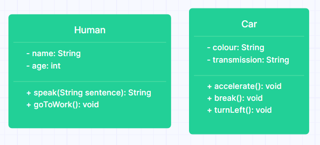

# Object-oriented Programming - Encapsulation

## Learning Objectives
- Define behaviour as the thing a program does
- Define state as the thing a program knows
- Explain that a class is a convenient encapsulation of behaviour and state
- Use encapsulation to package related state and behaviour together

## Set up instructions
- Fork this repository and clone the forked version to your machine
- Open the root directory of the project in IntelliJ

## Introduction

In object-oriented programming (OOP), we organise our code into multiple different objects in an effort to control the complexity of our project. Each of these objects are responsible for a single set of related behaviour and state, which we define in Java classes as methods and members.

Methods are actions that an object performs, members contain the data that the class knows. You can think of a class quite literally as any real world thing:

```
Human {
  name = "Joe Smith"
  age = 62
  
  speak(sentence)
  goToWork()
  run()
}

Car {
  colour = "Blue"
  transmission = "Manual"
  
  accelerate()
  break()
  turnLeft()
}
```

In the above examples, related behaviour and state are encapsulated into a single class. Consider a different example:

```
Human {
  name = "Joe Smith"
  transmission = "Manual"
  
  speak(sentence)
  turnWipersOn()
}
```

Does that class make sense? Maybe in a cyberpunk themed future, but not today! We call a class with unrelated behaviour / state a class with *low cohesion*. It doesn't make sense. When we're encapsulating program behaviour and state, we should always strive for *high cohesion* - everything in the class should relate to a single purpose.

In order to design a cohesive system, one useful technique is to start with a [class diagram](https://www.visual-paradigm.com/guide/uml-unified-modeling-language/what-is-class-diagram/).

Here's an example of a class diagram design for the above examples:



Using diagrams like this, we can visualise the structure of our project before we start building it. We won't always stick to the diagram exactly, it's impossible to think of every edge-case ahead of time, but it does allow us to get started on the right foot.

I used [gleek.io](https://www.gleek.io/) to create the diagram above. You can use any tool, including a piece of paper.

## Exercise 1

Design a class diagram to re-organise the below classes into a more cohesive system. Add your diagram to the repo and share your work in your cohort's classroom channel on Discord.

```
Bank
    balance = 620.14
    deposit(date, amount)
    withdraw(date, amount)
    generateStatementPDF()
    
Diary
    owner = "John Smith"
    lock()
    unlock()
    addEntry(entry)
    getEntries()
    
Calculator
    add(num1, num2)
    subtract(num1, num2)
    print(message)
```

## Exercise 2

Create a class diagram for the below user stories and then create real classes for them in the `./src/main/java/com/booleanuk/core` directory. Follow a test driven development approach, adding test classes to the `./src/test/java/com/booleanuk/core` directory.

Note that there is no "one correct way" to complete this exercise, this is an opportunity to practice designing and implementing a simple system. Making mistakes is expected and encouraged.

Additionally, don't worry about creating complex logic. The focus of this exercise is at an encapsulation level, we don't need to see a method that can actually recharge a lithium battery!

```
As a parent,
I want to buy my son a remote control toy car from your shop.

I want to be able to choose the colour of the car.

I want to be able to choose between rechargable and disposable batteries.

I want to choose between a simple and an advanced remote control.

I want to be able to see the battery percentage remaining.

I want to be able to move the car forward and backward a specific distance.

I want to be able to stop the car from moving.

I want to be able to turn left and right.

I want to be able to replace the battery if it breaks.

I want to be able to return the car for a refund if it breaks.
```

## Next steps

Now that you've practiced encapsulation, introduce this concept into your ongoing Bob's Bagels OOP exercise. Refactor your existing code if necessary. You should end up with multiple single purpose classes.

## Test Output


When you run a test, it's either going to pass or fail. When it fails, you'll be presented with a big red stream of text. This is called a stack trace and, though intimidating, does contain some useful information.

One of the core skills of a developer is debugging stack traces like this. The stack trace details in which classes & files the failure happened, and gives you a line number at the end. Most of the lines in the stack trace are irrelevant most of the time, you want to try and identify the files that you're actually working with.

In the sample screenshot below, we've tried to complete the first step of the exercise but provided an invalid value. Then we run the test associated with it and we see a big red stack trace, a test failure.

At the top, we see `expected: <32> but was: <33>`. This means the test expected the value to be 32, but the value the student provided was 33. We can see this in the code snippets at the top of the screenshot.

In the stack trace itself, we see this line: `at app//com.booleanuk.core.ExerciseTest.shouldBeAged32(ExerciseTest.java:20)`. This is helpful! This tells us the exact line in the ExerciseTest.java file (line 20) where the failure happened, as well as the method name (shouldBeAged32), helping us to identify where the issue began. This is the kind of thing you need to look for; a relevant file name, method name, class name and line number to give you a good starting point for debugging.


